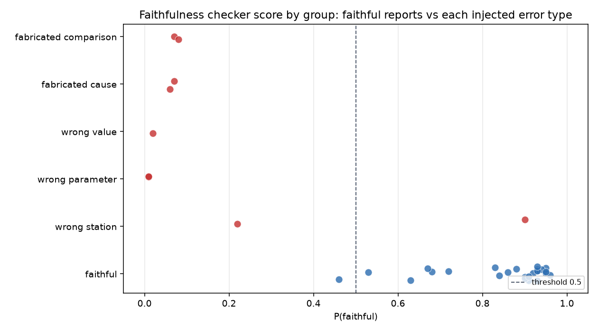
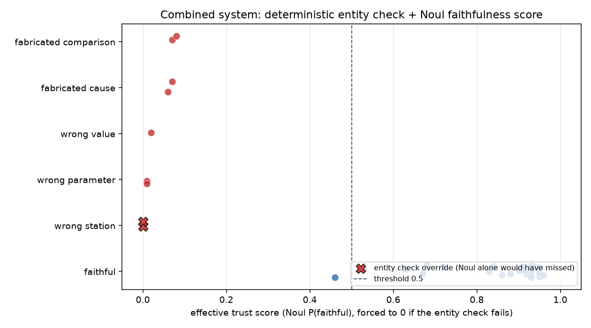

# Verified Anomaly Reports: When an AI Incident Report Gets the Right Numbers and the Wrong River

Water utilities are starting to use AI to help operators make sense of sensor data: an anomaly detector flags something unusual, and an AI writes a short report explaining what happened. But an AI-written report can sound completely confident while getting a fact wrong. This project builds that pipeline on real river sensor data, then deliberately tries to catch it lying, and finds a specific, real way it can fool one kind of checker and not another.

## The headline result

On real USGS river gauge data, including the real Hurricane Helene flood and the real Guadalupe River flood (both handled here strictly as flow-rate and timing data, never dramatized, out of respect for real and in one case fatal events), a simple anomaly detector flags unusual readings, an LLM writes a short incident report from exactly those flagged readings, and a semantic faithfulness checker (Typesafe / Noul) checks each report against the data it should be based on.

The checker catches almost every kind of fabricated claim correctly and consistently: a made-up cause, a made-up comparison to history, a number that quietly drifted from the true reading. It has one real blind spot. Swap the correct river's name for a different, real river's name, and leave every number and timestamp untouched, and the checker can miss it entirely. That specific failure, and a five-line deterministic fix for it that needs no AI at all, is the actual finding of this project.

## Data

Six real USGS stream gauges, September 2024 to August 2025, chosen for range rather than convenience:

| Station | Parameters | Why |
|---|---|---|
| French Broad River at Asheville, NC | streamflow, temperature | Hurricane Helene, September 27 2024 |
| Guadalupe River near Hunt, TX | streamflow | Texas Hill Country flash flood, July 4 2025 |
| Guadalupe River at Comfort, TX | streamflow | Same flood, downstream gauge, shows the flood wave arriving hours later |
| Potomac River near Washington, DC | streamflow, temperature | Large mid-Atlantic river, several moderate floods across the year, not one dominant event |
| Sacramento River at Freeport, CA | streamflow, temperature | Large regulated river with real tidal influence, the deliberately messiest station |
| Fall Creek near Ithaca, NY | streamflow | Small flashy creek, the opposite extreme from Sacramento |

382,516 readings pulled from the public USGS NWIS API, no key required.

Actually working with real sensor data meant finding, and fixing, two genuine data-quality problems, not just modeling clean numbers:

- Sacramento's water temperature is reported by two separate physical sensors under the same parameter code, "Right Bank Pump Stand" and "BGC Project, East Fender." They agree at 99.0% of timestamps across the year, so they are averaged into one series rather than silently double-counted or arbitrarily picked from.
- Four of the nine station-parameter series quietly mix 5-minute and 15-minute sampling within the same year, not tied to any flood event, most likely a mid-year telemetry change at those gauges. The anomaly detector's rolling window is defined by wall-clock time rather than row count specifically so this does not change how much history it is comparing against.

## Method

The anomaly detector is intentionally simple: a rolling, time-based interquartile-range fence, 14 days of trailing history, flag anything past 3 times the interquartile range from the trailing median. This project is not about detector sophistication, it is about what happens after something gets flagged, so the detector stays simple on purpose and says so in its own code. It caught all five known real events in the data (Helene, the Guadalupe flood at both gauges, a Potomac peak, a Fall Creek spike), with no threshold tuned toward that result.

For each flagged anomaly, an LLM (Claude Haiku) writes a short incident report from a real API call, using a strict prompt template: use only the packaged data (station, location, parameter, timestamp, value, and the normal range it's being compared against), never invent a cause, never invent a historical comparison, never state a guess as fact. Any report touching the Guadalupe flood carries an additional hard rule, written directly into the prompt as a constraint rather than left as a hope: stay strictly technical, flow rate and timing only, never reference human impact under any circumstance. This is a deliberate ethical choice, not an oversight, made before a single report was generated.

27 anomalies were sampled for evaluation (the 5 known real events plus 22 more spread across every station and a range of severity, not just the dramatic ones). A third of the sample, 9 reports, were then deliberately corrupted with one labeled error each: a wrong station name, a wrong parameter, a fabricated cause, a fabricated historical comparison, or a value that no longer matches the data. Both the real and corrupted versions were kept, always checked against the same true underlying data.

## The core finding

Faithful reports scored a mean P(faithful) of 0.847. Corrupted reports scored a mean of 0.160. Four of the five injected error types were caught almost perfectly, every single instance of a wrong parameter, a wrong value, a fabricated cause, or a fabricated comparison scored at or under 0.08.

`wrong_station` is the exception. One instance was caught (0.22). One was missed outright: swapping "Sacramento R at Freeport CA" for "American R at Freeport CA," a real, nearby, entirely plausible river name, with every number and timestamp in the report still correct, scored 0.90, essentially indistinguishable from a genuinely faithful report.



The plot makes the shape of the problem visible: five tight clusters near zero for the error types Noul catches, and one wrong_station point sitting inside the faithful cluster where it has no business being.

## The fix

Whether a specific station name appears in a specific piece of text is not a judgment call, it is an exact lookup, and code does exact lookups perfectly. So the fix is not a better prompt or a lower threshold, it is a second, independent, deterministic check: a small registry of the six station names, checked with plain substring matching, no AI involved, run before and separately from the faithfulness score. A report is now flagged untrustworthy if either check fails.

Combined, the gap closes completely. Both wrong_station cases are caught, the one Noul had already caught and the one it missed at 0.90. All 9 corrupted reports across all 5 error types are caught. Sometimes the right tool for catching a lie isn't more AI, it's a rule a computer can check perfectly.



Both wrong_station points now sit at zero, fully separated from the faithful cluster, marked with an X for exactly which check caught them.

## The honest twist

The deterministic check is not flawless, and claiming otherwise would undercut the entire point of this project. Stress-testing it against text the real sample never produced found real failure modes: a station referred to by a nickname ("the Sac River"), an abbreviated name ("French B. River"), or its bare USGS site ID all get wrongly flagged as a mismatch, even though the reference is completely correct. On the actual 27-report sample this never happened, every faithful report used a full station name, but that is a fact about this one sample and this one prompt template, not a general guarantee. A simple, reliable-sounding fix still needs its own limits stated plainly.

## What this actually shows

A semantic AI check and a deterministic check catch different, non-overlapping kinds of lies. Noul is good at judging whether a claim is actually supported by context, exactly what is needed for a fabricated cause or a drifted number. It is measurably weaker at an exact factual lookup, because that is not really a judgment call, and a fluent, locally plausible substitution can read as fine even when it is wrong. A deterministic check is the mirror image: perfect at an exact lookup, useless at judging whether a fabricated cause sounds plausible. A trustworthy AI-generated report pipeline needs both, not a stronger version of either alone, and even the simple, deterministic half of that pair needs its own honest limits documented, not assumed away.

## Limitations

- Small evaluation sample: 27 reports, 9 corrupted. Real, but not large enough to estimate precise error rates.
- One faithfulness-checking tool evaluated (Typesafe / Noul), not compared against alternative approaches.
- The deterministic entity check's own false-positive risks are demonstrated on synthetic text, not observed in the real sample, and the registry only covers full station names as this project's own prompt template produces them.
- One time period, one set of six stations. The anomaly detector and both checks are only shown to work here, not shown to generalize.

## Repository structure

```
src/data/            pulls and parses raw USGS NWIS data
src/detection/       the rolling time-based IQR anomaly detector
src/analysis/        inspection, detection runs, sampling for reports
src/generation/      the report prompt template and generation, including deliberate corruption
src/verification/    the Noul faithfulness check, the deterministic entity check, and their combination
scripts/             a standalone Typesafe/Noul sanity check
data/raw/            raw USGS pulls, not tracked
data/processed/      parsed readings, anomaly logs, generated reports, evaluation results, not tracked
reports/figures/     the two README figures (tracked); other plots gitignored
```

## Running it

```bash
python3 -m venv .venv
.venv/bin/pip install -r requirements.txt

.venv/bin/python src/data/fetch_nwis.py
.venv/bin/python src/data/parse_nwis.py
.venv/bin/python -m src.analysis.inspect_data
.venv/bin/python -m src.analysis.run_detection
.venv/bin/python -m src.analysis.flag_rate_sanity_check
.venv/bin/python -m src.analysis.sample_for_reports

ANTHROPIC_API_KEY=... .venv/bin/python -m src.generation.run_generation

TYPESAFE_API_KEY=... .venv/bin/python -m src.verification.run_faithfulness_eval
.venv/bin/python -m src.verification.plot_faithfulness_distribution
.venv/bin/python -m src.verification.run_combined_eval
.venv/bin/python -m src.verification.plot_combined_distribution
.venv/bin/python -m src.verification.entity_check_limitations_demo
```

`TYPESAFE_API_KEY` and `ANTHROPIC_API_KEY` are read from the environment only, never committed.
